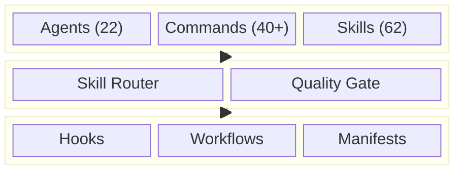

# SkillLord

**The all-in-one Claude Code plugin you install once and never outgrow.**

[](https://www.npmjs.com/package/@donganhvu16/claude-skill-lord)


---

## Why SkillLord?

- **Stop configuring, start building** — 62 skills, 22 agents, 40+ commands work out of the box
- **Only load what you need** — 3-tier system keeps context lean; specialty skills activate on demand
- **Design intelligence built-in** — 67 UI styles, 161 color palettes, reasoning engine for production-grade design decisions
- **Battle-tested foundations** — curated from [Everything Claude Code](https://github.com/affaan-m/everything-claude-code) + [ClaudeKit Engineer](https://github.com/claudekit/claudekit-engineer) + [UI/UX Pro Max](https://github.com/nextlevelbuilder/ui-ux-pro-max-skill)

---

## Quick Start

**Via npm (recommended):**

```bash
npm i @donganhvu16/claude-skill-lord
```

**Via git clone:**

```bash
git clone https://github.com/donganhvuphp/Claude-Skills-Lord.git
cd skilllord
node scripts/install.js developer --target /path/to/your/project
```

**Dry-run first:**

```bash
node scripts/install.js full --dry-run
```

---

## Install Profiles

| Profile | Skills | Agents | Best For |
|---------|--------|--------|----------|
| `core` | 16 (Tier 1) | 7 | Small projects, quick setup |
| `developer` | 44 (Tier 1+2) | 22 | Full development workflow |
| `full` | 62 (all tiers) | 22 | Multi-language, enterprise |

---

## Architecture



---

## Key Commands

| Command | Description |
|---------|-------------|
| `/plan` | Create implementation plan |
| `/code` | Start coding from plan |
| `/test` | Run and validate tests |
| `/fix` | Fix issues (variants: `fast`, `hard`, `ci`, `test`, `types`, `ui`, `logs`) |
| `/cook` | Implement features end-to-end |
| `/tdd` | Test-driven development workflow |
| `/debug` | Deep root-cause investigation |
| `/design` | Create UI designs (variants: `fast`, `good`, `3d`) |
| `/route` | Get skill recommendations for your task |
| `/audit` | Run quality gate checks |

<details>
<summary><strong>All commands (40+)</strong></summary>

| Command | Description |
|---------|-------------|
| `/review` | Code review with confidence filtering |
| `/scout` | Search and explore codebase |
| `/bootstrap` | Initialize new projects |
| `/e2e` | Generate and run E2E tests |
| `/brainstorm` | Explore solutions and trade-offs |
| `/learn` | Extract patterns from session |
| `/evolve` | Iterative feature development |
| `/build-fix` | Fix build/compile errors |
| `/refactor-clean` | Dead code cleanup |

See [commands/](commands/) for the full list.

</details>

---

## Agents

<details>
<summary><strong>22 agents — click to expand</strong></summary>

| Agent | Role |
|-------|------|
| planner | Technical planning with 9 mental models |
| architect | System design and scalability |
| code-reviewer | Quality assessment with >80% confidence filtering |
| security-reviewer | OWASP vulnerability detection |
| tdd-guide | RED-GREEN-REFACTOR workflow |
| debugger | Root cause investigation methodology |
| build-error-resolver | Build and compile error fixing |
| e2e-runner | Playwright E2E test generation |
| refactor-cleaner | Dead code cleanup |
| git-manager | Version control operations |
| docs-manager | Documentation management |
| project-manager | Progress tracking |
| ui-ux-designer | UI/UX design |
| database-admin | Database optimization |
| brainstormer | Solution ideation (YAGNI/KISS/DRY) |
| copywriter | Conversion-focused content |
| scout | Parallel codebase exploration |
| loop-operator | Autonomous development loops |
| chief-of-staff | Multi-channel coordination |
| harness-optimizer | Agent self-optimization |
| skill-router | Advisory skill recommendations |
| quality-gate | Output validation |

</details>

---

## Skills (62, 3 Tiers)

### Tier 1 — Core (16, always loaded)

debugging, code-review, tdd-workflow, testing, backend-development, frontend-development, web-frameworks, ui-styling, **ui-ux-pro-max**, react-best-practices, databases, api-design, devops, security-patterns, sequential-thinking, research

### Tier 2 — On-Demand (28)

<details>
<summary>Click to expand</summary>

ai-multimodal, better-auth, payment-integration, continuous-learning, codebase-onboarding, autonomous-loops, mcp-management, frontend-patterns, backend-patterns, coding-standards, e2e-testing, deployment-patterns, docker-patterns, postgres-patterns, database-migrations, mcp-server-patterns, eval-harness, verification-loop, strategic-compact, mobile-development, claude-code, planning, problem-solving, google-adk-python, media-processing, **design-system**, **design**, **brand**

</details>

### Tier 3 — Specialty (18)

<details>
<summary>Click to expand</summary>

python-patterns, golang-patterns, rust-patterns, kotlin-patterns, django-patterns, laravel-patterns, springboot-patterns, swiftui-patterns, pytorch-patterns, shopify, threejs, vercel-deploy, agentic-engineering, prompt-optimizer, cost-aware-llm-pipeline, **ui-styling-canvas**, **banner-design**, **slides**

</details>

---

## Hooks & Automation

| Hook | Trigger | What it does |
|------|---------|--------------|
| Config protection | PreToolUse | Prevents weakening linter/formatter configs |
| Auto-format | PostToolUse | Runs Biome or Prettier on edited JS/TS files |
| Type check | PostToolUse | Validates TypeScript after edits |
| Console.log check | Stop | Flags debug code left in modified files |
| Quality gate | PostToolUse | Lint + types + tests + security checks |

---

## Testing

```bash
node tests/run-all.js
```

---

## Attribution

Built on the shoulders of giants:

> [Everything Claude Code](https://github.com/affaan-m/everything-claude-code) by Affaan Mustafa — foundation agents, skills, hooks
>
> [ClaudeKit Engineer](https://github.com/claudekit/claudekit-engineer) by Duy Nguyen — mental models, strategic depth, unique agents
>
> [UI/UX Pro Max Skill](https://github.com/nextlevelbuilder/ui-ux-pro-max-skill) by Next Level Builder — design intelligence, 67 styles, 161 color palettes, brand & design-system skills (MIT)

## Contributing

See [CONTRIBUTING.md](CONTRIBUTING.md) for guidelines.

## License

[MIT](LICENSE)
