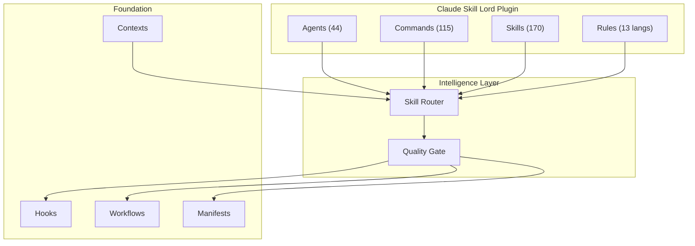

# Claude Skill Lord

**The all-in-one Claude Code plugin you install once and never outgrow.**

[](https://www.npmjs.com/package/claude-skill-lord)


---

## Why Claude Skill Lord?

- **Stop configuring, start building** — 170 skills, 44 agents, 115 commands work out of the box
- **Multi-language support** — 13 language-specific rule sets (TypeScript, Python, Go, Rust, Java, Kotlin, C++, C#, PHP, Perl, Swift)
- **Language-specific agents** — dedicated reviewers and build resolvers for 8 languages
- **Design intelligence built-in** — 67 UI styles, 161 color palettes, reasoning engine for production-grade design decisions
- **Battle-tested foundations** — curated from [ClaudeKit Engineer](https://github.com/claudekit/claudekit-engineer) (base) + [Everything Claude Code](https://github.com/affaan-m/everything-claude-code) (cherry-picked)

---

## Quick Start

### Install globally (recommended)

```bash
npm i -g claude-skill-lord
```

### Set up in any project

```bash
cd your-project
csl init                # developer profile (recommended)
claude                 # start coding with Claude Skill Lord
```

That's it. `csl init` copies skills, agents, and commands into `.claude/` and generates `plugin.json` automatically.

### CLI commands

```bash
csl init                # interactive setup (asks profile + target)
csl init full           # install everything (170 skills + canvas fonts)
csl init --dry-run      # preview without copying
csl init --fresh        # clean reinstall
csl upgrade full        # upgrade to full profile (additive, no overwrites)
csl update              # update CLI to latest version
csl migrate             # update project files after csl update
csl migrate --dry-run   # preview what would change
csl diff                # compare project files with source package
csl uninstall           # remove from current project
csl doctor              # check health + available updates
csl list                # show all components with install status
```

### Alternative: per-project install

```bash
npm i claude-skill-lord
npx csl init
```

### Alternative: git clone

```bash
git clone https://github.com/donganhvuphp/Claude-Skills-Lord.git
cd Claude-Skills-Lord
node scripts/sl.js init full --target /path/to/your/project
```

---

## Install Profiles

| Profile | Skills | Agents | Rules | Best For |
|---------|--------|--------|-------|----------|
| `core` | 170 | 44 | — | Minimal setup |
| `developer` | 170 | 44 | 13 languages | Recommended for all projects (default) |
| `full` | 170 | 44 + canvas fonts | 13 languages + MCP configs | Multi-language, design, enterprise |

---

## Architecture



---

## Usage

### Plan → Code → Test

The most common workflow — plan first, then implement, then validate:

```
/plan Add user authentication with OAuth2
/code
/test
```

### Fix issues

```
/fix login not redirecting after auth
/fix:ci                              # fix from CI/CD logs
/fix:types                           # fix TypeScript errors
/fix:fast connection timeout on API  # quick fix, no deep research
```

### Design UI

```
/design:good Landing page for a fintech SaaS
/design:fast Signup button with glassmorphism style
/design:3d Interactive 3D product showcase
```

### Explore and understand code

```
/scout src/ find all API endpoints
/route I need to refactor the authentication module
/review:codebase
```

### Build features end-to-end

```
/cook Add dark mode toggle in settings page
/brainstorm Should we use WebSocket or SSE for real-time notifications?
/bootstrap:auto Next.js SaaS starter with auth and payments
```

### Multi-agent workflows (new)

```
/multi-plan Complex feature requiring multiple perspectives
/multi-backend Microservice architecture implementation
/orchestrate Coordinate multiple agents on a large task
```

### Session management (new)

```
/save-session     # save current work context
/resume-session   # resume where you left off
/checkpoint       # create a recovery point
```

### Language-specific workflows (new)

```
/rust-build       # build Rust project
/go-review        # review Go code
/kotlin-test      # test Kotlin project
/cpp-build        # build C++ project
/python-review    # review Python code
```

---

## Key Commands

| Command | Description |
|---------|-------------|
| `/plan` | Create implementation plan (variants: `fast`, `hard`, `two`, `cro`, `ci`) |
| `/code` | Start coding from plan |
| `/test` | Run and validate tests |
| `/fix` | Fix issues (variants: `fast`, `hard`, `ci`, `test`, `types`, `ui`, `logs`) |
| `/cook` | Implement features end-to-end |
| `/tdd` | Test-driven development workflow |
| `/debug` | Deep root-cause investigation |
| `/design` | Create UI designs (variants: `fast`, `good`, `3d`, `screenshot`, `video`, `describe`) |
| `/route` | Get skill recommendations for your task |
| `/audit` | Run quality gate checks |

<details>
<summary><strong>All commands (115)</strong></summary>

| Category | Commands |
|----------|----------|
| **Core** | `/plan`, `/code`, `/test`, `/fix`, `/cook`, `/debug`, `/tdd`, `/verify` |
| **Review** | `/code-review`, `/python-review`, `/rust-review`, `/go-review`, `/cpp-review`, `/kotlin-review` |
| **Build** | `/build-fix`, `/cpp-build`, `/go-build`, `/kotlin-build`, `/rust-build`, `/gradle-build` |
| **Test** | `/test-coverage`, `/e2e`, `/cpp-test`, `/go-test`, `/kotlin-test`, `/rust-test` |
| **Design** | `/design:fast`, `/design:good`, `/design:3d`, `/design:screenshot`, `/design:video`, `/design:describe` |
| **Content** | `/content:fast`, `/content:good`, `/content:cro`, `/content:enhance` |
| **Docs** | `/docs:init`, `/docs:update`, `/docs:summarize`, `/update-docs` |
| **Git** | `/git:pr`, `/git:cp`, `/git:cm`, `/commit_gen` |
| **Multi-agent** | `/multi-plan`, `/multi-workflow`, `/multi-backend`, `/multi-frontend`, `/multi-execute`, `/orchestrate` |
| **Session** | `/save-session`, `/resume-session`, `/sessions`, `/checkpoint` |
| **Scout** | `/scout`, `/scout:ext` |
| **Bootstrap** | `/bootstrap`, `/bootstrap:auto`, `/bootstrap:auto/fast` |
| **Skills** | `/skill:add`, `/skill:create`, `/skill:optimize`, `/skill:fix-logs`, `/skill-create`, `/skill-health` |
| **Quality** | `/quality-gate`, `/audit`, `/refactor-clean`, `/prompt-optimize` |
| **Loop** | `/loop-start`, `/loop-status` |
| **Other** | `/brainstorm`, `/learn`, `/evolve`, `/model-route`, `/route`, `/ask`, `/journal`, `/watzup` |

See [commands/](commands/) for the full list.

</details>

---

## Agents

<details>
<summary><strong>44 agents — click to expand</strong></summary>

### Core Agents

| Agent | Role |
|-------|------|
| planner | Technical planning with 9 mental models |
| architect | System design and scalability |
| code-reviewer | Quality assessment with >80% confidence filtering |
| security-reviewer | OWASP vulnerability detection |
| tdd-guide | RED-GREEN-REFACTOR workflow |
| debugger | Root cause investigation methodology |
| build-error-resolver | Build and compile error fixing |
| e2e-runner | Playwright E2E test generation |
| refactor-cleaner | Dead code cleanup |
| git-manager | Version control operations |
| docs-manager | Documentation management |
| doc-updater | Documentation specialist |
| docs-lookup | Documentation researcher |
| project-manager | Progress tracking |
| ui-ux-designer | UI/UX design |
| database-admin | Database optimization |
| database-reviewer | Database review specialist |
| brainstormer | Solution ideation (YAGNI/KISS/DRY) |
| copywriter | Conversion-focused content |
| scout | Parallel codebase exploration |
| scout-external | External tool-based exploration |
| loop-operator | Autonomous development loops |
| chief-of-staff | Multi-channel coordination |
| harness-optimizer | Agent self-optimization |
| skill-router | Advisory skill recommendations |
| quality-gate | Output validation |
| researcher | Deep research agent |
| tester | Test execution agent |
| mcp-manager | MCP server management |
| journal-writer | Session journaling |

### Language-Specific Reviewers

| Agent | Language |
|-------|----------|
| typescript-reviewer | TypeScript |
| python-reviewer | Python |
| rust-reviewer | Rust |
| go-reviewer | Go |
| kotlin-reviewer | Kotlin |
| java-reviewer | Java |
| cpp-reviewer | C++ |
| flutter-reviewer | Flutter/Dart |

### Language-Specific Build Resolvers

| Agent | Language |
|-------|----------|
| cpp-build-resolver | C++ |
| rust-build-resolver | Rust |
| java-build-resolver | Java |
| kotlin-build-resolver | Kotlin |
| go-build-resolver | Go |
| pytorch-build-resolver | PyTorch |

</details>

---

## Skills (170)

All skills live in `./skills/<name>/SKILL.md` — flat structure.

<details>
<summary><strong>Click to expand full skill list</strong></summary>

### Development Core
debugging, code-review, tdd-workflow, testing, backend-development, frontend-development, web-frameworks, ui-styling, databases, api-design, devops, sequential-thinking, research, planning, problem-solving, coding-standards

### Frontend & Design
ui-ux-pro-max, react-best-practices, frontend-patterns, frontend-design, frontend-slides, design, design-system, brand, banner-design, slides, aesthetic, web-design-guidelines, liquid-glass-design, threejs

### Backend & API
backend-patterns, api-design, api-versioning, graphql-patterns, rest-api-security, microservice-patterns, mcp-server-patterns, mcp-management, mcp-builder

### Language Patterns
python-patterns, golang-patterns, rust-patterns, kotlin-patterns, java-patterns, cpp-patterns, perl-patterns, swift-patterns, django-patterns, laravel-patterns, springboot-patterns, swiftui-patterns, nuxt4-patterns

### Language Testing & Security
python-testing, golang-testing, rust-testing, kotlin-testing, cpp-testing, django-tdd, laravel-tdd, springboot-tdd, django-security, laravel-security, springboot-security, django-verification, laravel-verification, springboot-verification

### Language Specialized
kotlin-coroutines-flows, kotlin-exposed-patterns, kotlin-ktor-patterns, java-coding-standards, cpp-coding-standards, swift-actor-persistence, swift-concurrency-6-2, swift-protocol-di-testing, jpa-patterns, compose-multiplatform-patterns

### Mobile
mobile-development, android-clean-architecture, flutter-riverpod, flutter-dart-code-review

### DevOps & Infrastructure
deployment-patterns, docker-patterns, ci-cd-patterns, docker-optimization, kubernetes-patterns, terraform-patterns, vercel-deploy

### Database
postgres-patterns, database-migrations, clickhouse-io

### AI & ML
ai-multimodal, pytorch-patterns, google-adk-python, cost-aware-llm-pipeline, foundation-models-on-device, prompt-optimizer

### Agentic Engineering
agentic-engineering, agent-harness-construction, agent-eval, autonomous-loops, continuous-agent-loop, continuous-learning, continuous-learning-v2, eval-harness, verification-loop, enterprise-agent-ops

### Content & Business
article-writing, technical-writing, content-engine, crosspost, market-research, investor-outreach, investor-materials, shopify, ecommerce-patterns, saas-patterns

### Security & Auth
security-review, security-scan, better-auth, payment-integration, safety-guard

### Media & Processing
media-processing, video-editing, videodb, fal-ai-media, nutrient-document-processing

### Tools & Utilities
repomix, chrome-devtools, docs-seeker, documentation-lookup, skill-creator, data-scraper-agent, exa-search, x-api, bun-runtime, nanoclaw-repl, dmux-workflows

### Research & Strategy
deep-research, strategic-compact, search-first, iterative-retrieval, codebase-onboarding, blueprint, santa-method, team-builder

### Domain-Specific
carrier-relationship-management, customs-trade-compliance, energy-procurement, inventory-demand-planning, logistics-exception-management, production-scheduling, quality-nonconformance, returns-reverse-logistics, visa-doc-translate

### Meta & Config
claude-code, claude-api, claude-devfleet, configure-ecc, skill-comply, skill-stocktake, rules-distill, plankton-code-quality, ralphinho-rfc-pipeline, regex-vs-llm-structured-text, click-path-audit, context-budget, content-hash-cache-pattern, project-guidelines-example, plan-preview, template-skill, e2e-testing

</details>

---

## Rules (13 Languages)

Language-specific coding rules in `./rules/`:

| Language | Files |
|----------|-------|
| Common | agents, coding-style, development-workflow, git-workflow, hooks, patterns, performance, security, testing |
| TypeScript | coding-style, hooks, patterns, security, testing |
| Python | coding-style, hooks, patterns, security, testing |
| Go | coding-style, hooks, patterns, security, testing |
| Rust | coding-style, hooks, patterns, security, testing |
| Java | coding-style, hooks, patterns, security, testing |
| Kotlin | coding-style, hooks, patterns, security, testing |
| C++ | coding-style, hooks, patterns, security, testing |
| C# | coding-style, hooks, patterns, security, testing |
| PHP | coding-style, hooks, patterns, security, testing |
| Perl | coding-style, hooks, patterns, security, testing |
| Swift | coding-style, hooks, patterns, security, testing |

---

## Hooks & Automation

| Hook | Trigger | What it does |
|------|---------|--------------|
| Block no-verify | PreToolUse | Prevents bypassing git hooks |
| Config protection | PreToolUse | Prevents weakening linter/formatter configs |
| Scout block | PreToolUse | Controls scout command usage |
| Auto-format | PostToolUse | Runs Biome or Prettier on edited JS/TS files |
| Type check | PostToolUse | Validates TypeScript after edits |
| Console.log check | Stop | Flags debug code left in modified files |
| Quality gate | PostToolUse | Lint + types + tests + security checks |
| Modularization | PostToolUse | Suggests splitting files >200 LOC |
| Session management | Start/Stop | Save and restore session context |
| Discord/Telegram notify | Stop | Send notifications on session end |

---

## Contexts

Development contexts in `./contexts/` for specialized workflows:

| Context | Use Case |
|---------|----------|
| `dev.md` | Development context |
| `research.md` | Research context |
| `review.md` | Code review context |

---

## Testing

```bash
node tests/run-all.js
```

---

## Attribution

Built on the shoulders of giants:

> [ClaudeKit Engineer](https://github.com/claudekit/claudekit-engineer) by Duy Nguyen — base architecture, mental models, strategic depth, unique agents
>
> [Everything Claude Code](https://github.com/affaan-m/everything-claude-code) by Affaan Mustafa — cherry-picked agents, skills, commands, rules
>
> [UI/UX Pro Max Skill](https://github.com/nextlevelbuilder/ui-ux-pro-max-skill) by Next Level Builder — design intelligence, 67 styles, 161 color palettes, brand & design-system skills (MIT)

## Contributing

See [CONTRIBUTING.md](CONTRIBUTING.md) for guidelines.

## License

[MIT](LICENSE)
